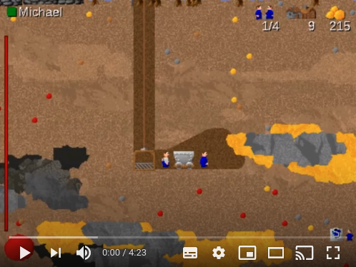

# Settlerclonk

Settlerclonk is an AI assisted player character for the game [Clonk Planet](http://clonk.de/classics.php?lng=en).

## License

CC BY-NC, see LICENSE file for details.

## Official build

[The original release from 2001 is still hosted at CCAN](https://ccan.de/cgi-bin/ccan/ccan-view.pl?a=view&i=489)

## How to build

1. You need **rsync**, which is probably installed already. You can check with `$ which rsync`
2. You need **c4group**, which is part of OpenClonk: `$ sudo apt install openclonk`
3. `$ make`

You should now find **7K_Settlerclonk.c4d** in the **build** directory.

## What does it do?

*Translation of TIPPS.c4d/DescDE.txt:*

Here are a few hints on how to use the features of Settlerclonk effectively:

- Don't bother with intermediate products, just start producing the final product that you want (e.g. Tera explosives) and Settlerclonk will perform dependency resolution, building all intermediate products like explosives and super explosives automatically.

- You can define two separate color coded transport routes that have different priorities. The green route has a higher priority than the blue one, when in overwatch mode, Settlerclonk will postpone servicing the blue route when a new object appears at the green starting point. When the green transport job is complete, work on the blue route resumes, if the blue route was active before getting interrupted, even if it was not marked as auto resume.
If the green route has three starting points, the start 1 will have the highest priority, start 3 the lowest.

- Use transport filters: Set a transport route from the minecart in your goldmine to your home base, where only gold will get picked up, while simultaneusly have a route from the chemical plant to the minecart where only Tera explosives get transported. Now the mine will get a steady supply of explosives, only the gold will get sold at the home base and nobody accidentally moves intermediate products from the chemical plant to the mine. If you want to be extra efficient, you'll make sure that the route from the chemical plant to the mine has a higher priority than from the mine to the home base.

- If you have three lumbermills, it can make sense to convert the blue route into two additional starts for the green route. Now you can set all three minecarts in front of your three lumbermills as starting points and your home base as the destination. If you also set the checkmark for automatic selling you'll make money automatically. You can also enable overwatch mode to automatically resume work when new trees got chopped down

- After setting up an extensive configuration, you can use the communications menu to send all settings to another own Settlerclonk. This can be useful when one Settlerclonk is overwhelmed; sending the current config to a different Settler basically adds another worker to the same job.
